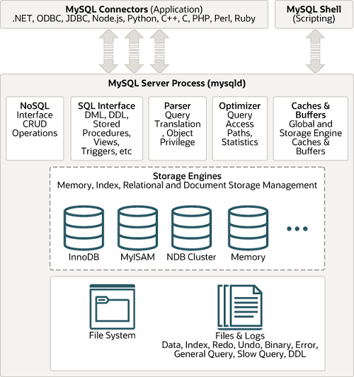
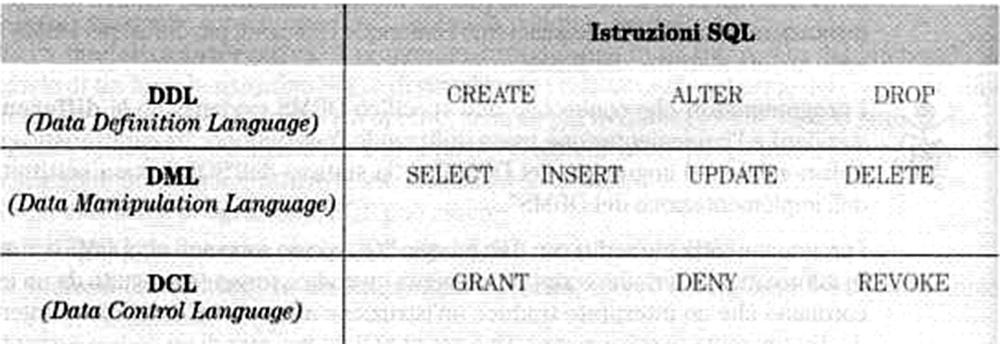

## Architettura di MySQL e MariaDB

[MySQL](https://www.mysql.com/) è un Database Management Systems (DBMS) progettato secondo una architettura `client <-> server`.
.

Maggiori dettagli sull'architettura di MySQL si possono trovare su [MySQL tutorial - architecture](https://www.mysqltutorial.org/mysql-administration/mysql-architecture/).

[MariaDB](https://mariadb.org/) è un fork del progetto di MySQL a partire dalla versione 5.7 e mantiene una ampissima compatibilità nei comandi SQL con MySQL. È un progetto open source e mantiene una licenza più permissiva rispetto a quella di MySQL a partire dalla versione 8.0 in poi.
MariaDB esiste in due versioni:

- [Community Server](https://mariadb.com/products/community-server/)
- [Enterprise Server](https://mariadb.com/products/enterprise/)

Per ambito scolastico si farà riferimento alla versione Community di MariaDB.

## Riferimenti

I riferimenti a MySQL e MariaDB si trovano sul manuale utente del database:

- [MySQL 9 Manual](https://dev.mysql.com/doc/refman/9.0/en/)
- [MariaDB Documentation](https://mariadb.com/kb/en/documentation/)

## Caratteristiche del linguaggio

### SQL è un linguaggio per la gestione dei database relazionali

- **Definizione dello schema logico**
- **Aggiornamento e interrogazione dei  dati**
- **Gestione della sicurezza del DBMS**

### SQL è un linguaggio dichiarativo

Per realizzare un servizio del sistema informativo basta dichiarare le proprietà che devono soddisfare i risultati e non come ottenerli …
Ad esempio per *"ricercare nella base di dati tutti gli studenti della classe 5A"* Il programmatore non deve realizzare un programma per la ricerca dei dati, ma si limiterà a scrivere:

```sql
SELECT *
FROM Studenti
WHERE ClasseFrequentata = '5A' 
```

### SQL può essere utilizzato in due modi

#### Modalità interattiva

Si utilizza un interprete di comandi testuale o grafico che permette di eseguire e visualizzare i risultati delle query

#### Modalità programma

L’SQL è utilizzato all’interno di un altro linguaggio,denominato host (ad esempio PHP,  Java, etc …)

## SQL: componenti del linguaggio



## SQL: primi passi, con MySQL

L’introduzione all'SQL sarà fatta per passi con esempi tratti dall’utilizzo del database MySQL/mariaDB.

Il database MySQL/mariaDB è strutturato secondo un’architettura client/server.

Il server è l’entità che gestisce i cataloghi dei database con le tabelle e risponde alle richieste pervenute tramite un client.

Il client è un programma che comunica col server tramite un socket TCP/IP ( tipicamente sulla porta 3306)

Client e server sono tipicamente su host differenti!

Per il database MySQL sono disponibili diversi client:

- MySQL WorkBench, phpMyAdmin, etc. – sono strumenti grafici (GUI)
- MySQL monitor - è un client a riga di comando

### Visualizzazione dei database disponibili

```sql
SHOW DATABASES ;
```

### Selezione di uno specifico DB

```sql
USE database_name;
```

Con questa direttiva si indica di voler lavorare con il DB database_name, fino a quando non si indica un database diverso.

### Creazione di un database

Un database può essere creato con l'istruzione:

```sql
CREATE DATABASE database_name;
```

oppure, in generale (le parentesi quadre indicano un parametro opzionale)

```sql
CREATE DATABASE [IF NOT EXISTS] database_name
[CHARACTER SET charset_name]
[COLLATE collation_name];
```

Sulla [pagina di MySQL Tutorial relativa alla creazione di un database](https://www.mysqltutorial.org/mysql-basics/mysql-create-database/) si trovano maggiori dettagli su come creare un database. In particolare si presti attenzione al concetto di **[charset](https://www.mysqltutorial.org/mysql-basics/mysql-character-set/)** e di **[collation](https://www.mysqltutorial.org/mysql-basics/mysql-collation/)**.

Le impostazioni di default del server di MySQL possono essere ispezionate con il comando [indicato nel manuale di](https://dev.mysql.com/doc/refman/9.0/en/server-system-variables.html):

```bash
mysqld --verbose --help
```

Ad esempio, nel caso di MySQL:

```bash
mysqld --verbose --help | grep character-set-server
mysqld --verbose --help | grep collation-server
```

Oppure nel caso di MariaDB:

```bash
mariadbd --verbose --help | grep character-set-server
mariadbd --verbose --help | grep collation-server
```

Per MariaDB le impostazioni di default possono essere recuperate (nella bash del server) con il comando:

```bash
docker exec -it mariadb-server1 /bin/bash
# nella shell del server si può eseguire il comando:
my_print_defaults --mysqld
# mentre, per ottenere tutte le impostazioni del server, si può eseguire il comando:
mariadbd --verbose --help
```

Per ulteriori dettagli si veda anche la pagina relativa a [MariaDB su Docker Hub](https://hub.docker.com/_/mariadb)

### CHARACTER e COLLATION

Il CHARACTER e la COLLATION possono essere impostati

- a livello di database:

  - In fase di creazione:

  ```sql
  CREATE DATABASE database_name
  CHARACTER SET character_set_name
  COLLATE collation_name;
  ```

  - oppure, in fase di modifica del database:

  ```sql
  ALTER DATABASE database_name
  CHARACTER SET character_set_name
  COLLATE collation_name;
  ```

- a livello di tabella:

  - In fase di creazione:

      ```sql
      CREATE TABLE table_name(
      ...
      )
      CHARACTER SET character_set_name
      COLLATE collation_name;
      ```

  - oppure, in fase di modifica:

      ```sql
      ALTER TABLE table_name(
      ...
      )
      CHARACTER SET character_set_name
      COLLATE collation_name;
      ```

- a livello di colonna, sia in fase di creazione che di modifica:
  
    ```sql
    column_name [CHAR | VARCHAR | TEXT] (length)
    CHARACTER SET character_set_name
    COLLATE collation_name
    ```

Per capire il concetto di charset e di collation si possono consultare anche le [pagine introduttive di MariaDB su character set e collation](https://mariadb.com/kb/en/character-set-and-collation-overview/), oppure le [pagine che descrivono come impostare character set e collation](https://mariadb.com/kb/en/setting-character-sets-and-collations/).

Un interessante approfondimento che spiega molti aspetti su character set e collation di MySQL e MariaDB è l'articolo *[Everything you never wanted to know about MySQL Charsets & Collations](https://www.coderedcorp.com/blog/guide-to-mysql-charsets-collations)* di Vince Savino.

#### Impostazioni predefinite di Collation e Character Set in MariaDb

Per impostazione predefinita, in MariaDb il default character set è `utf8mb4`, ossia `UTF-8` rappresentato su 4 byte, mentre la collation associata è `utf8mb4_uca1400_ai_ci`

#### Impostazioni predefinite di Collation e Character Set in MySQL

Per impostazione predefinita, in MySQL il default character set è `utf8mb4`, ossia `UTF-8` rappresentato su 4 byte, mentre la collation associata è `utf8mb4_0900_ai_ci`

### Cancellazione di un database

```sql
DROP DATABASE [IF EXISTS] database_name;
```

Oppure, siccome in MySQL lo schema è sinonimo di database, si può anche scrivere:

```sql
DROP SCHEMA [IF EXISTS] database_name;
```

Si veda anche [MySQL Tutorial - DROP DATABASE](https://www.mysqltutorial.org/mysql-basics/mysql-drop-database/)

### Creazione di una tabella

[MySQL Tutorial - CREATE TABLE](https://www.mysqltutorial.org/mysql-basics/mysql-create-table/)

Una tabella può essere creata con un'istruzione del tipo seguente:

```sql
CREATE TABLE [IF NOT EXISTS] table_name(
   column1 datatype constraints,
   column2 datatype constraints,
   ...
) ENGINE=storage_engine;
```

Ad esempio:

```sql
CREATE TABLE IF NOT EXISTS studenti (
  Matricola MEDIUMINT UNSIGNED NOT NULL AUTO_INCREMENT,
  Cognome varchar(30) NOT NULL,
  Nome varchar(30) NOT NULL,
  DataNascita date NOT NULL,
  Genere enum('M','F') NOT NULL,
  Nazione varchar(30) NOT NULL default 'Italia',
  E-Mail varchar(50),
  PRIMARY KEY  (Matricola),
  UNIQUE KEY CognomeNomeDataN(Cognome,Nome, DataNascita)
) ENGINE=InnoDB; 
```

### Verificare la struttura di una tabella

```sql
DESCRIBE table_name;
```

### Ottenere l'istruzione di creazione di una tabella

```sql
SHOW CREATE TABLE table_name;
```

### Inserire dati in una tabella

L'istruzione per inserire dati in una tabella è `INSERT INTO`, secondo la sintassi seguente:

```sql
INSERT INTO table(column1, column2,...) 
VALUES 
  (value1, value2,...), 
  (value1, value2,...), 
  ...
  (value1, value2,...);
```

Per specificare una tabella occorre definire i domini (i tipi) delle colonne, ed i vincoli d’integrità.
I vincoli d’integrità sono di tre tipi:

- Integrità sulle colonne
- Integrità sulle tabelle
- Integrità referenziale (tra le colonne in comune delle tabelle in relazione)

### Recuperare i dati di una tabella (SELECT)

Per recuperare i dati di una tabella l'istruzione da usare è la `SELECT`, secondo lo schema:

```sql
SELECT select_list
FROM table_name;
```

### Cancellazione di una tabella (DROP TABLE)

[MySQL tutorial - DROP TABLE](https://www.mysqltutorial.org/mysql-basics/mysql-drop-table/)

```sql
DROP [TEMPORARY] TABLE [IF EXISTS] table_name [, table_name] ...
[RESTRICT | CASCADE]
```

### Visualizzazione delle tabelle di un database (SHOW TABLES)

[MySQL tutorial - SHOW TABLES](https://www.mysqltutorial.org/mysql-administration/mysql-show-tables/)

```sql
SHOW TABLES;
```

Oppure:

```sql
SHOW FULL TABLES;
```

## Domini

### Numeri in MySQL/MariaDB

- [Bit](https://www.mysqltutorial.org/mysql-basics/mysql-bit/)
- Numeri [Interi](https://www.mysqltutorial.org/mysql-basics/mysql-int/) (INT, TINYINT, SMALLINT, MEDIUMINT, BIGINT)
- Numeri floating point (valori approssimati) [(FLOAT, DOUBLE)](https://dev.mysql.com/doc/refman/9.0/en/floating-point-types.html)
- Numeri [DECIMAL](https://www.mysqltutorial.org/mysql-basics/mysql-decimal/)

Attenzione al giusto dominio:

Nei calcoli scientifici di solito si usano i domini numerici approssimati FLOAT o DOUBLE, mentre nei calcoli finanziari ed economici si usano i numeri esatti in virgola fissa DECIMAL. Un FLOAT ha solo 6 cifre decimali significative, mentre un DOUBLE ne ha (solo) 15.

Ad esempio `DECIMAL(10,3)` è un numero a 10 cifre decimali complessive e con 3 cifre dopo la virgola.
In MySQL un DECIMAL può avere fino a 65 cifre significative complessive e fino a 30 cifre dopo la virgola

### Caratteri e testo

- Caratteri [CHAR](https://www.mysqltutorial.org/mysql-basics/mysql-char-data-type/) e [VARCHAR](https://www.mysqltutorial.org/mysql-basics/mysql-varchar/)
- Testo [TEXT](https://www.mysqltutorial.org/mysql-basics/mysql-text/)

### Enumerativo

- [ENUM](https://www.mysqltutorial.org/mysql-basics/mysql-enum/)

### Date e tempo

- [DATE](https://www.mysqltutorial.org/mysql-basics/mysql-date/)
- [DATETIME](https://www.mysqltutorial.org/mysql-basics/mysql-datetime/)
- [TIME](https://www.mysqltutorial.org/mysql-basics/mysql-time/)
- [TIMESTAMP](https://www.mysqltutorial.org/mysql-basics/understanding-mysql-timestamp/)
  
### BLOB and BINARY

- [BLOB](https://www.mysqltutorial.org/mysql-basics/mysql-blob/)
- [BINARY](https://www.mysqltutorial.org/mysql-basics/mysql-binary/)
- [VARBINARY](https://www.mysqltutorial.org/mysql-basics/mysql-varbinary/)

### Boolean

- [BOOLEAN](https://www.mysqltutorial.org/mysql-basics/mysql-boolean/)

### JSON

- [JSON](https://www.mysqltutorial.org/mysql-json/mysql-json-data-type/)

### Altre caratteristiche dei dati

- [`AUTO_INCREMENT`](https://www.mysqltutorial.org/mysql-basics/mysql-auto_increment/): Una colonna di tipo intero può avere l'attributo `AUTO_INCREMENT`  per indicare che il suo valore può essere generato automaticamente dal DBMS ad ogni inserimento. Tipicamente si usa per definire l'ID di tabelle, che sono anche chiavi primarie.
- [`UNSIGNED`](https://www.mysqltutorial.org/mysql-basics/mysql-int/): Una colonna di tipo intero può essere `UNSIGNED` nei casi in cui può assumere solo valori non negativi.

:::caution[Attenzione]
Alcuni attributi dei campi numerici sono considerati deprecati. In particolare, sono considerati [deprecati](https://dev.mysql.com/doc/refman/9.0/en/numeric-type-attributes.html) i seguenti attributi:


- `ZEROFILL` e il `campo display` per gli interi
- `UNSIGNED` per i tipi `FLOAT`, `DOUBLE` e `DECIMAL`
- `AUTO_INCREMENT` per i tipi `FLOAT` e `DOUBLE`

:::

### Vincoli di integrità di colonna

- Vincolo [`DEFAULT`](https://www.mysqltutorial.org/mysql-basics/mysql-default/): È possibile specificare un valore di default per una colonna, da utilizzare qualora non venga fornito in input nessun valore dal client.

  :::note[Nota]
  Nel caso in cui il valore di default non sia specificato e il client non fornisca nessun valore per la colonna, il [comportamento del database dipende (in MySQL) dall’SQL mode adoperato](https://dev.mysql.com/doc/refman/9.0/en/data-type-defaults.html).
  - In MySQL, se non è specificato il valore di default e non è fornito nessun valore in ingresso (oppure è fornito NULL) per la colonna:
  - Se la colonna può avere valore nullo, allora viene automaticamente assegnato il valore nullo (NULL).
  - Se la colonna non può assumere il valore nullo, allora:
    - Se non è abilitata la modalità SQL `strict mode`, MySQL assegna alla colonna il valore di default implicito per il tipo di dato della colonna (0 per i dati numerici interi, stringa vuota per le stringhe, valore `zero` per le date e timestamp , il primo valore della lista per ENUM)
    - Se è abilitata la modalità SQL `strict mode`, MySQL dà un messaggio d’errore e il dato non è inserito.
  - Per i tipi TEXT e BLOB non è possibile assegnare un valore di default.
  - Il valore di default deve essere una costante
  :::
- Vincolo `CHECK`. Il vincolo `CHECK` viene utilizzato per verificare se il valore che si vuole assegnare ad un attributo soddisfa determinati criteri.
  - Ad esempio, [nel caso di MySQL](https://www.mysqltutorial.org/mysql-basics/mysql-check-constraint/):
  
    ```sql
    CONSTRAINT constraint_name 
    CHECK (expression) 
    [ENFORCED | NOT ENFORCED]
    ```

  - Nel [caso di MariaDB](https://www.mariadbtutorial.com/mariadb-basics/mariadb-check-constraint/):

    ```sql
    column_name datatype 
    constraint constraint_name 
    check(expression)
    ```

### Guida Pratica: Quando Usare `CHECK` e Quando Usare `TRIGGER` in MariaDB

Nella progettazione di database relazionali, l'integrità dei dati è un concetto fondamentale. MariaDB, come altri RDBMS, offre diversi strumenti per garantirla. Due di questi strumenti, talvolta confusi, sono i vincoli `CHECK` e i `TRIGGER`.

La regola generale di progettazione prevede di **preferire un vincolo `CHECK` a un `TRIGGER`** quando possibile. Il vincolo `CHECK` è una soluzione dichiarativa, ovvero descrive *cosa* deve essere vero, lasciando al database l'onere dell'implementazione. Un approccio dichiarativo è, di norma, più pulito, leggibile e performante.

Un `TRIGGER`, al contrario, è una soluzione procedurale. Si tratta di un blocco di codice SQL che viene eseguito automaticamente dal database in risposta a un determinato evento su una tabella specifica (come un `INSERT`, `UPDATE` o `DELETE`). Il trigger definisce *come* eseguire un controllo o un'azione. Questo potente strumento offre una grande flessibilità, ma la sua complessità è maggiore. I trigger saranno oggetto di studio approfondito in parti successive del corso.

A causa di limitazioni storiche nell'implementazione di MariaDB e MySQL, è necessario comprendere quando l'uso di `CHECK` è affidabile e quando invece è indispensabile ricorrere a un `TRIGGER`. Questa guida fornisce un'analisi pratica di tali scenari.

### 1. Scenari Ideali per l'Utilizzo del Vincolo `CHECK`

L'utilizzo di un vincolo `CHECK` è la soluzione corretta e raccomandata nei seguenti casi:

- **Validazione su singola colonna con valori statici**: Questo è lo scenario d'uso primario e più sicuro. Il vincolo verifica che il valore di una colonna rispetti una condizione predefinita.

    ```sql
    -- Esempio: Il prezzo deve essere positivo
    ALTER TABLE Prodotti ADD CONSTRAINT CHK_PrezzoPositivo CHECK (PrezzoUnitario > 0);

    -- Esempio: Il ruolo deve essere uno di quelli specificati (anche se ENUM è meglio)
    ALTER TABLE Giocatori ADD CONSTRAINT CHK_RuoloValido CHECK (Ruolo IN ('Portiere', 'Difensore', 'Centrocampista', 'Attaccante'));

    ```

- **Confronto tra due colonne nella stessa riga**: I vincoli `CHECK` possono confrontare i valori di più colonne all'interno della stessa riga che viene inserita o aggiornata. Questo è particolarmente utile per garantire la coerenza logica tra dati correlati.

    ```sql
    -- Esempio: La data di restituzione deve essere successiva a quella del prestito
    ALTER TABLE Prestiti ADD CONSTRAINT CHK_CoerenzaDate CHECK (DataRestituzioneEffettiva IS NULL OR DataRestituzioneEffettiva >= DataPrestito);

    ```

### 2. Scenari in cui è Necessario Utilizzare un `TRIGGER`

Esistono situazioni in cui le limitazioni dell'implementazione di `CHECK` in MariaDB richiedono l'uso di un `TRIGGER` per garantire l'integrità dei dati. È opportuno ricorrere a un `TRIGGER` nei seguenti casi:

- **Riferimenti a funzioni non deterministiche**: Un vincolo `CHECK` non può contenere funzioni il cui output può variare a ogni esecuzione, anche con gli stessi parametri di input. Funzioni come `NOW()`, `CURDATE()`, `UUID()`, `RAND()` rientrano in questa categoria.

    ```sql
    -- QUESTO NON FUNZIONA
    ALTER TABLE Ordini ADD CONSTRAINT CHK_DataOrdine CHECK (DataOrdine <= CURDATE());

    ```

- **Riferimenti a subquery o altre tabelle**: La logica di un vincolo `CHECK` non può basarsi su dati esterni alla riga corrente. Non è possibile, quindi, eseguire una subquery (`SELECT`) per validare un valore.

    ```sql
    -- QUESTO NON FUNZIONA
    ALTER TABLE Partite ADD CONSTRAINT CHK_SquadraInStagione
    CHECK (IDSquadraCasa IN (SELECT IDSquadra FROM SquadrePerStagione WHERE IDStagione = NEW.IDStagione)); -- NEW non è accessibile qui

    ```

- **Casi di confronto tra colonne non affidabili**: Sebbene il confronto tra colonne sia generalmente supportato, esistono casi limite (come il controllo di disuguaglianza `IDSquadraCasa <> IDSquadraOspite`) che in alcune versioni o configurazioni di MariaDB/MySQL possono non funzionare come previsto o generare errori. Data questa inaffidabilità, per un vincolo così critico per l'integrità del modello, la soluzione più robusta e universalmente compatibile è l'implementazione tramite `TRIGGER`.

### Strategia Operativa Consigliata

Per determinare l'approccio corretto senza dover memorizzare ogni caso specifico, si può adottare un flusso di lavoro metodico in tre fasi:

1. **Tentativo Dichiarativo con `CHECK`**: Il primo passo consiste sempre nel tentare di implementare la logica di validazione tramite un vincolo `CHECK`, utilizzando la sintassi standard `ALTER TABLE ... ADD CONSTRAINT ... CHECK (...)`. Questo rappresenta l'approccio ingegneristicamente più corretto.

2. **Test di Verifica Rigoroso**: Dopo aver definito il vincolo, è fondamentale testarne il comportamento.

    - Se il database **restituisce un errore** durante la creazione del vincolo, è evidente che la sintassi o la logica non sono supportate.

    - Se il database **accetta il vincolo**, è necessario un test funzionale: si devono eseguire istruzioni `INSERT` o `UPDATE` che violano deliberatamente il vincolo. Se il database impedisce l'operazione sollevando un errore, il vincolo `CHECK` è attivo e funzionante. Se, al contrario, i dati errati vengono inseriti senza errori, significa che il database ha accettato la sintassi ma sta ignorando la logica del vincolo (un comportamento noto in versioni datate di MySQL).

3. **Implementazione Procedurale con `TRIGGER`**: Solo se la verifica al punto 2 fallisce, si deve procedere con l'implementazione della medesima logica attraverso un `TRIGGER` di tipo `BEFORE INSERT` e `BEFORE UPDATE`. Questo garantisce che il controllo venga eseguito in modo affidabile.

Questo approccio metodico assicura l'utilizzo della soluzione migliore e più efficiente disponibile, ricorrendo all'implementazione procedurale tramite trigger solo quando le limitazioni del sistema lo rendono indispensabile.

### Modalità operativa di MariaDB

MariaDB supporta [diverse modalità operative](https://mariadb.com/kb/en/sql-mode/) e l'opzione di default corrisponde a:

```sql
STRICT_TRANS_TABLES, ERROR_FOR_DIVISION_BY_ZERO , NO_AUTO_CREATE_USER, NO_ENGINE_SUBSTITUTION
```

Per verificare la modalità operativa del server è possibile eseguire la query:

```sql
SELECT @@SQL_MODE, @@GLOBAL.SQL_MODE;
```

Per impostare la modalità operativa è possibile eseguire la query:

```sql
SET GLOBAL sql_mode = 'modes';
SET SESSION sql_mode = 'modes';
```

### Modalità operative di MySQL

MySQL supporta [diverse modalità operative](https://dev.mysql.com/doc/refman/9.0/en/sql-mode.html) e l'opzione di default corrisponde a:

```sql
ONLY_FULL_GROUP_BY,STRICT_TRANS_TABLES,NO_ZERO_IN_DATE,NO_ZERO_DATE,ERROR_FOR_DIVISION_BY_ZERO,NO_ENGINE_SUBSTITUTION
```

Per verificare la modalità operativa del server è possibile eseguire la query:

```sql
SELECT @@GLOBAL.sql_mode;
SELECT @@SESSION.sql_mode;
```

Per impostare la modalità operativa è possibile eseguire la query:

```sql
SET GLOBAL sql_mode = 'modes';
SET SESSION sql_mode = 'modes';
```
